# LogAn

## LLM-powered Log Analytics with Causal Inference

From thousands of raw log lines to a ranked causal story - with every claim
traceable back to the exact line it came from.

<!--
Presenter: this deck doubles as the demo script. Every screenshot comes from
the bundled deterministic incident (demo/logs), so the numbers on these
slides reproduce exactly on any machine. Setup: scripts\local.ps1, then
python scripts/seed_demo_case.py --logs-dir demo/logs
-->

---

# The Problem

Incident triage today:

- One production incident scatters evidence across **tens of thousands of log lines** in
  multiple services.
- The first symptom people see (HTTP 500s) is usually the **last link** of the causal chain.
- Reading raw logs does not scale; grepping finds what you already suspect.
- Sharing raw logs with an LLM is a **data-governance non-starter**.

---

# What LogAn Does

Organize the incident as a **case**: upload logs, run one analysis, review five linked views.

| View | Question it answers |
| --- | --- |
| Data Summary | What kinds of things happened, and how much reading did I just save? |
| Temporal View | When did it happen - what is the shape of the incident? |
| Tabular Logs | Show me the exact evidence lines. |
| Causal Graph | What likely caused what? |
| Causal Summary | The story in prose, with next actions and exports. |

On the demo incident: **2,613 raw lines become 8 reviewable patterns - 99.7% less to read.**

---

# How It Works

```mermaid
flowchart LR
    A[Ingest + hash] --> B[Merge stack traces]
    B --> C[Redact]
    C --> D[Template clustering]
    D --> E[Representative sampling]
    E --> F[LLM annotation]
    F --> G[Broadcast labels]
    G --> H[Time windows]
    H --> I[Causal inference]
    I --> J[RCA summary + exports]
```



Two invariants hold end to end:

1. **Traceability** - every derived object carries `file:line` evidence references.
2. **Representative lines only** - the model never sees raw logs, only a handful of
   redacted representative samples per template.

---

# Privacy by Design

- Redaction runs **before** anything model-facing exists: emails, IPs, bearer tokens,
  passwords, API keys, JWTs, UUIDs, card-like values, tenant IDs.
- Model calls receive redacted representative samples only - a few lines per pattern,
  not the log stream.
- Progress events, artifacts, metrics, and reports are **count-only** by design; raw log
  text never leaks into them.
- Fully offline demo mode: a deterministic mock stands in for the LLM, so results are
  identical on every run.

---

# The Demo Incident

A one-hour synthetic checkout outage (~2,600 lines, four files, gzip included):

```text
10:08  auth-service DB connection pool runs hot            (WARN,  root cause brewing)
10:10  pool exhausted                                      (ERROR, root cause)
10:11  payment-service times out calling auth-service      (ERROR, mid-chain symptom)
10:12  gateway returns 500 on POST /checkout               (ERROR, user-visible symptom)
10:33  recovery
       + unrelated batch-job disk errors mid-incident      (the red herring)
```

Also planted: multi-line Java stack traces, emails/IPs/tokens/card numbers, healthy
traffic before and after.

<!--
Regenerate anytime with: python scripts/generate_demo_logs.py
The wording is aligned with the mock annotator's rules, so the analysis
below is fully reproducible offline.
-->

---
layout: image-right
image: images/demo/01-cases-list.png
---

# Sign In and Cases

- Authentication is **SSO-only**; a built-in mock identity provider signs you in locally
  with zero credentials.
- Everything hangs off a **case**: logs, analysis runs, reports, collaborators, audit trail.
- The queue cards give an at-a-glance health check of open incidents.

<!--
Click "Continue with SSO" - provisioning is automatic on first sign-in.
-->

---
layout: image-right
image: images/demo/02-new-case.png
---

# Create a Case

- Capture incident context: title, description, product / service / environment,
  incident window.
- Attach evidence in the same step - plain logs, JSONL, or **gzip/zip archives**.
- Every uploaded byte is stored with a SHA-256 hash, so all later conclusions
  can be traced to the exact file and line.

<!--
Drag all four files from demo/logs in one go, including batch-jobs.log.gz.
-->

---
layout: image-right
image: images/demo/03-case-workspace.png
---

# The Case Workspace

- One page per incident: AI analyst chat, uploads, analysis runs, and report shortcuts.
- Starting an analysis streams **ten pipeline steps** live through the progress panel.
- On the demo data the full pipeline completes in seconds.

<!--
While the progress panel runs, this is the moment to explain
"representative lines only" - the previous invariant slide.
-->

---
layout: image-right
image: images/demo/04-summary.png
---

# Data Summary

- **2,613 raw lines -> 8 attention patterns; 99.7% review reduction.**
- Each row is one message pattern standing in for up to hundreds of identical lines.
- Golden-signal colors are consistent across the whole product:
  red = error, orange = saturation, purple = availability, blue = traffic.
- The first row already hints at the story: auth-service pool saturation at **10:08** -
  four minutes before any user-visible failure.

---
layout: image-right
image: images/demo/05-temporal.png
---

# Temporal View

- The incident has a **shape**: calm green traffic, then orange saturation at 10:08,
  purple availability and red errors stacking up, sharp recovery at 10:33.
- One-minute windows by default; group by signal, service, fault category, or template.
- Every bar is clickable and deep-links into Tabular Logs filtered to that window.

<!--
Click the tallest bar around 10:14, then "Open in Tabular Logs".
-->

---
layout: image-right
image: images/demo/07-logs-redaction.png
---

# Tabular Logs - Redaction

Search `user_email`:

- Emails, IPs, and session IDs appear as `<EMAIL>`, `<IP>`, `<UUID>` - masked in the
  pipeline **before any model call**; the same rules cover tokens, card numbers, keys.
- Each row keeps its `file:line` evidence reference with one-click copy for tickets.
- Level and signal chips reuse the same semantic colors.

---
layout: image-right
image: images/demo/07b-logs-stacktrace.png
---

# Tabular Logs - Stack Traces

Search `SocketTimeoutException`:

- Six physical lines of a Java stack trace arrive as **one logical record** -
  multi-line merging happens at ingestion, so traces never fragment the statistics.
- The merged entry still counts as a single occurrence of its error pattern.

---
layout: image-right
image: images/demo/08-causal-graph.png
---

# Causal Graph

- Nodes are problem patterns (same signal colors); arrows point from
  **candidate cause to symptom**.
- Only the strongest edges are drawn; the full ranked list sits in the table below.
- The chain reads exactly like the incident:
  **auth pool exhausted -> payment timeout -> gateway 500**.
- The batch-job disk errors - concurrent in time - stay peripheral: the evidence
  does not support them as a cause.

<!--
Click the red-ringed root-cause candidate and one strong edge to show the
evidence panel on the right.
-->

---

# Causal Evidence, Not Verdicts

Every edge aggregates independent statistical evidence:

| Method | What it checks |
| --- | --- |
| Temporal precedence | Does the cause consistently start first? |
| Lift | Does the target rate rise when the source is active? |
| Lagged correlation | Do the count series correlate at an offset? |
| PGEM-style score | Directed transition support, coverage, and median lag |
| Granger-style score | Do lagged source counts predict target counts? (BH-adjusted) |
| PageRank | Position of the node in the candidate graph |

Everything ships as `candidate_cause` with `needs_validation: true` - LogAn ranks what
to verify first; it does not declare root cause.

---
layout: image-right
image: images/demo/09-causal-summary.png
---

# Causal Summary (RCA)

- A prose narrative built from the evidence packet: candidate root cause, claims,
  uncertainties, next validation actions, and a customer-safe update draft.
- Wording is deliberately cautious - "evidence suggests", "candidate" - because logs
  propose hypotheses; metrics and traces confirm them.
- One-click export to Markdown / HTML / JSON for tickets and postmortems.

---

# From Demo to Production

| Demo (this deck) | Production |
| --- | --- |
| Deterministic mock annotator | AI Platform LLM (same pipeline, same UI) |
| SQLite metadata | PostgreSQL |
| Local object store | S3 / MinIO presigned + multipart uploads |
| Synchronous analysis | Temporal workflow / worker |
| SQL-backed reports | Optional ClickHouse / OpenSearch at scale |

All switches are configuration - no code changes between the two worlds.

---

# Frequently Asked

**Is this real AI?** Locally it is a deterministic mock (reproducible, offline).
In production the same pipeline calls AI Platform models; pipeline, UI, and
redaction guarantees are identical.

**Is our log data safe?** Models only ever see a few redacted representative lines
per pattern. Metrics, events, and reports are count-only by design.

**Can I trust the causal graph?** It is explicitly *candidate* causality - multiple
statistical methods rank what to validate first; nothing is declared proven.

---
layout: cover
---

# Try It

```powershell
.\scripts\local.ps1                                  # start API + web
python scripts/seed_demo_case.py --logs-dir demo/logs   # seed this exact demo
```

- Quick start, Docker options, and docs: see the repository README
- Regenerate the demo logs: `python scripts/generate_demo_logs.py`
- Regenerate these screenshots: `node scripts/shoot_demo_screens.js <caseId> <runId> docs/images/demo`
- Present this deck: `npx slidev docs/demo-guide.md`

<!--
Reset between rehearsals: stop the API, delete .logan/, restart, re-seed.
-->
