# LogAn 演示教程（演讲稿）

> 面向 10–15 分钟的现场分享。每一节给出：**你要点什么**、**观众会看到什么**（配截图）、
> **你可以怎么讲**（可以直接照着说的话术）。英文快速版见文末 Quick reference。
> 所有截图来自仓库自带的确定性演示数据，任何人都可以完整复现。

---

## 开场（30 秒）

> "每次线上事故，最痛苦的事情是从几万行日志里找出'到底哪里先出的问题'。
> LogAn 做的事情是：你把日志丢给它，它把几千行压缩成几个'消息模板'，
> 标注出哪些是错误、哪些是饱和，把事故过程画成时间线，
> 最后给出一条**候选因果链**——告诉你'A 大概率引起了 B，B 引起了 C'，
> 并且每一步结论都能点回到原始日志行。下面我用一个真实形态的结账故障来演示。"

演示数据的故事（你自己心里要有数）：

```
10:08  auth-service 数据库连接池开始吃紧（WARN）
10:10  连接池耗尽（ERROR，根因）
10:11  payment-service 调用 auth-service 超时（ERROR，中间症状）
10:12  gateway 的 POST /checkout 开始返回 500（ERROR，用户看到的表象）
10:33  恢复。另有批处理磁盘错误作为"红鲱鱼"混在中间。
```

四个文件约 2600 行，其中还埋了：多行 Java 堆栈（演示合并）、邮箱/IP/token/卡号（演示脱敏）、
一个 gzip 压缩包（演示归档摄取）。

---

## 第 0 幕：演示前的准备（观众到场前完成）

```powershell
.\scripts\local.ps1          # 启动 API + Web（Docker 方式见 README）
```

数据二选一：

- **现场演上传**（推荐，上传体验是卖点）：什么都不用做，`demo/logs/` 里的四个文件就是道具；
- **提前灌好**：`python scripts/seed_demo_case.py --logs-dir demo/logs`，直接从第 3 幕开始讲。

排练后重置环境：停掉 API，删除 `.logan` 目录，重新启动即可。

---

## 第 1 幕：登录与案例列表（1 分钟）

打开 http://localhost:3000 ，点 **Continue with SSO**，直接进入案例列表。

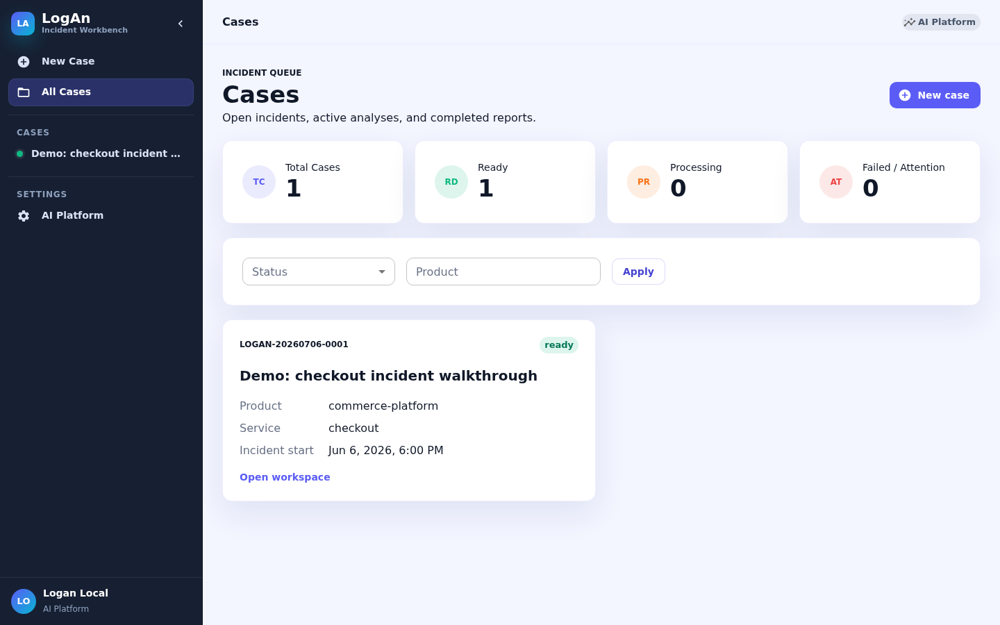

**你可以这么讲：**

> "LogAn 只支持企业 SSO 登录，本地演示用内置的 mock 身份源，所以不需要密码。
> 进来第一眼是案例列表——LogAn 以'案例'组织一切：一次事故就是一个案例，
> 日志、分析、报告、协作者都挂在案例下面。顶部四张卡片是案例的健康度概览。"

## 第 2 幕：创建案例 + 上传日志（2 分钟）

点左上角 **New Case**，填写标题（比如 "Checkout API intermittent 500 errors"）、
描述、产品/服务/环境，选择事故时间窗 10:00–11:00。

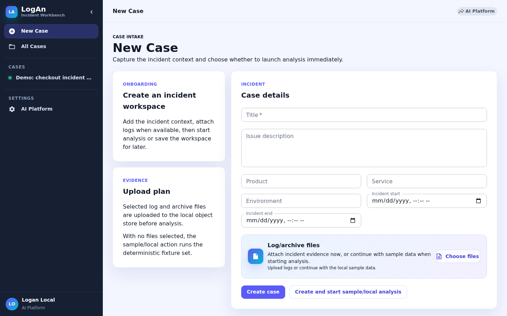

然后在 **Log/archive files** 区域把 `demo/logs/` 下的四个文件拖进去
（`auth-service.log`、`payment-service.log`、`gateway.log`、`batch-jobs.log.gz`），
点 **Create case**，在案例工作台里启动分析。

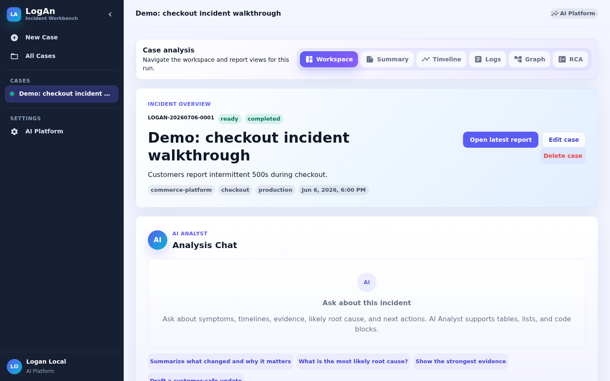

**你可以这么讲：**

> "注意我扔进去的有一个 .gz 压缩包——gzip、zip、JSONL 都能直接吃。
> 每个文件落盘时都记了 SHA-256 哈希，后面所有结论都能溯源到'哪个文件第几行'。
> 点开始分析，下面的进度面板会实时走完十个步骤：摄取、多行合并、脱敏、模板聚类、
> 采样、模型标注、标签广播、时间聚合、因果推断、生成报告。
> 这里有一个刻意的设计：**原始日志从头到尾不会发给大模型**——
> 只有每个模板挑出的几条'代表样本'，而且是脱敏之后的。这是这套系统能进生产的前提。"

（分析在演示数据上十几秒内完成。）

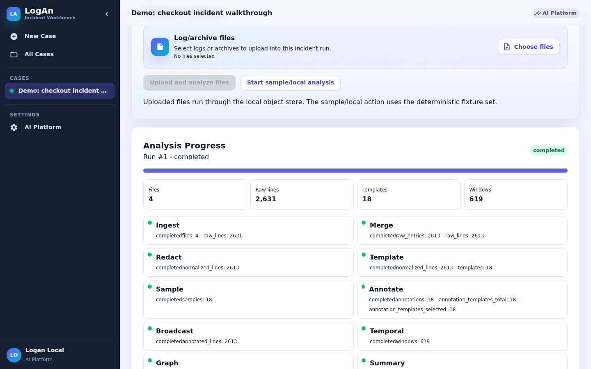

## 第 3 幕：Data Summary——第一个"哇"点（2 分钟）

进入报告的 **Summary** 页。

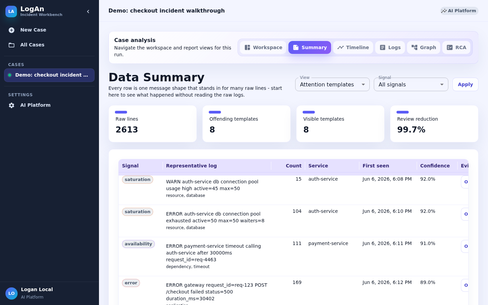

**你可以这么讲：**

> "重点看这四个数字：2613 行原始日志，需要人看的只剩 **8 个模板**，
> 审阅量削减 **99.7%**。这就是模板聚类的价值——
> 一百多条'连接池耗尽'在这里是一行，而不是一百行。
> 每一行给了信号分类：橙色 saturation 是资源饱和，紫色 availability 是可用性，
> 红色 error 是显式错误。注意第一行——auth-service 连接池饱和，
> 出现时间 10:08，比网关 500 早了四分钟。记住这个伏笔。"

## 第 4 幕：Temporal View——事故的形状（1.5 分钟）

切到 **Timeline** 页。

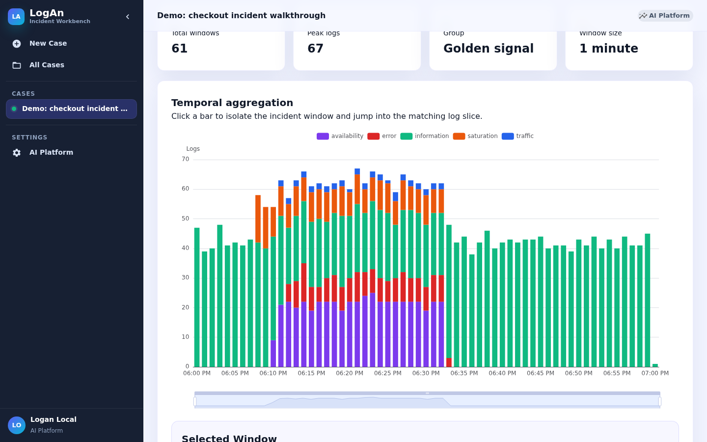

**你可以这么讲：**

> "这是整个小时的日志分布，一分钟一根柱子。绿色是正常流量——前十分钟很平静；
> 10:08 开始橙色（饱和）冒头，接着紫色（可用性）和红色（错误）堆起来，
> 10:33 之后瞬间恢复。事故的'形状'一眼可见。
> 每根柱子都可以点——点一下事故峰值，再点 Open in Tabular Logs，
> 就带着这一分钟的过滤条件直接跳进原始日志。"

（现场就点峰值那根柱子跳转，衔接下一幕。）

## 第 5 幕：Tabular Logs——证据层（2 分钟）

在 **Logs** 页演示两个搜索：

搜 `user_email`：

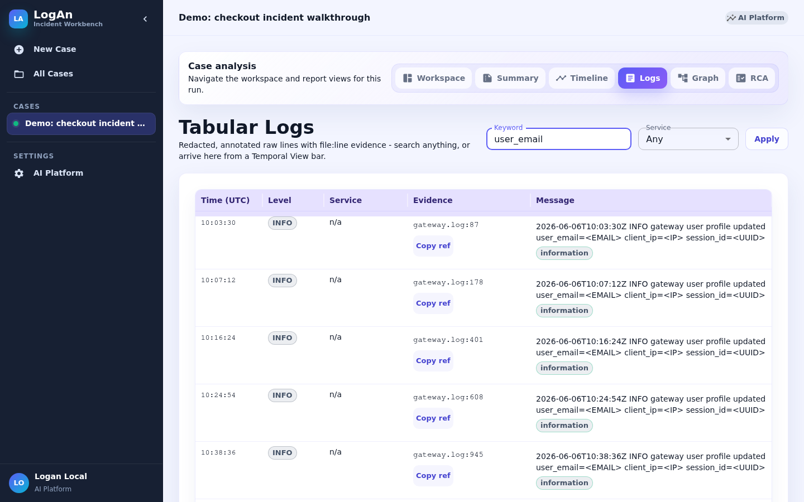

> "看消息内容：`<EMAIL>`、`<IP>`、`<UUID>`——邮箱、IP、会话号在进任何模型之前就被掩码了，
> 同一批规则还覆盖 token、卡号、密钥。左边是文件名:行号的证据引用，可以一键复制进工单。"

再搜 `SocketTimeoutException`：

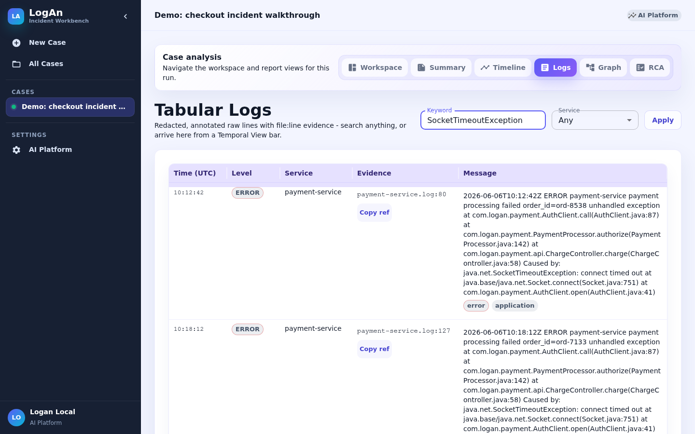

> "这是一段 Java 堆栈——六行物理行在这里是一条逻辑记录，
> 多行合并在摄取时就完成了，堆栈不会把统计打散。"

## 第 6 幕：Causal Graph——本场的高潮（3 分钟）

切到 **Graph** 页。

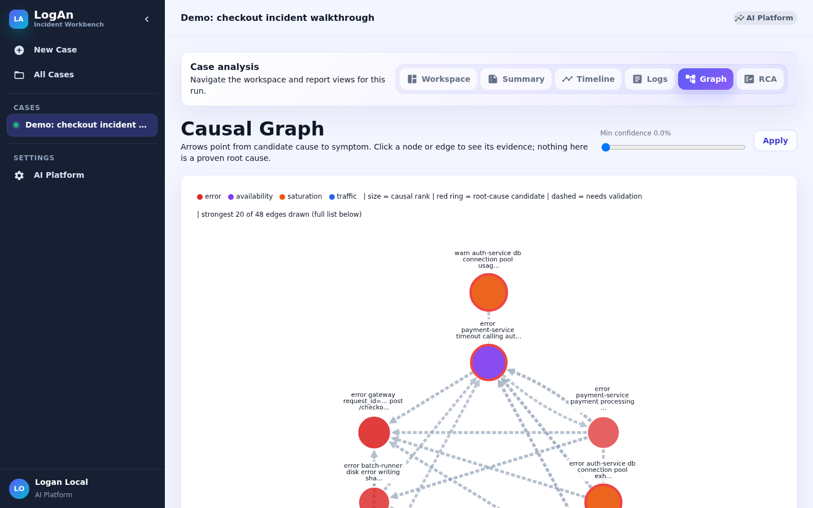

**你可以这么讲：**

> "前面都是'发生了什么'，这张图回答'为什么'。
> 每个节点是一个问题模板，颜色就是刚才的信号色；箭头从'候选原因'指向'症状'。
> 图上只画置信度最高的 20 条边，完整列表在下面的表格里。
> 顺着最粗的箭头看：**auth-service 连接池耗尽 → payment 调用超时 → 网关 500**——
> 和我们埋的故事完全一致。而右下角那个批处理磁盘错误，时间上也在事故中间，
> 但它只挂在链条外围——时序、提升度、Granger 这些证据方法都不支持它是原因。
> 点任何一条边，右侧会列出支持这条边的每一种证据和置信度。
> 强调一句：这些全部叫 **candidate**（候选），字段里就带着 needs_validation——
> 系统帮你把验证方向排好序，而不是替你拍板。"

（现场点击红圈的根因候选节点，展示右侧证据面板。）

## 第 7 幕：Causal Summary——给人读的结论（1.5 分钟）

切到 **RCA** 页。

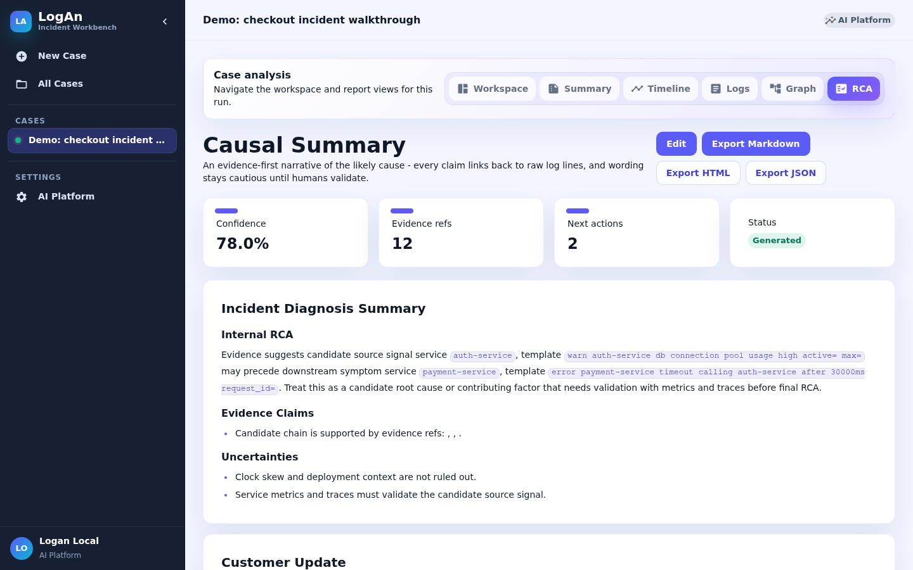

**你可以这么讲：**

> "最后是给人读的版本：候选根因指向 auth-service 连接池饱和，
> 每条论断后面都跟着证据引用，下面还有'下一步验证动作'和可以直接发给客户的通报草稿。
> 措辞刻意保守——'evidence suggests'、'candidate'——
> 因为日志只能提出假设，确认根因永远需要指标和 trace。
> 整份报告可以一键导出 Markdown/HTML/JSON 附到工单里。"

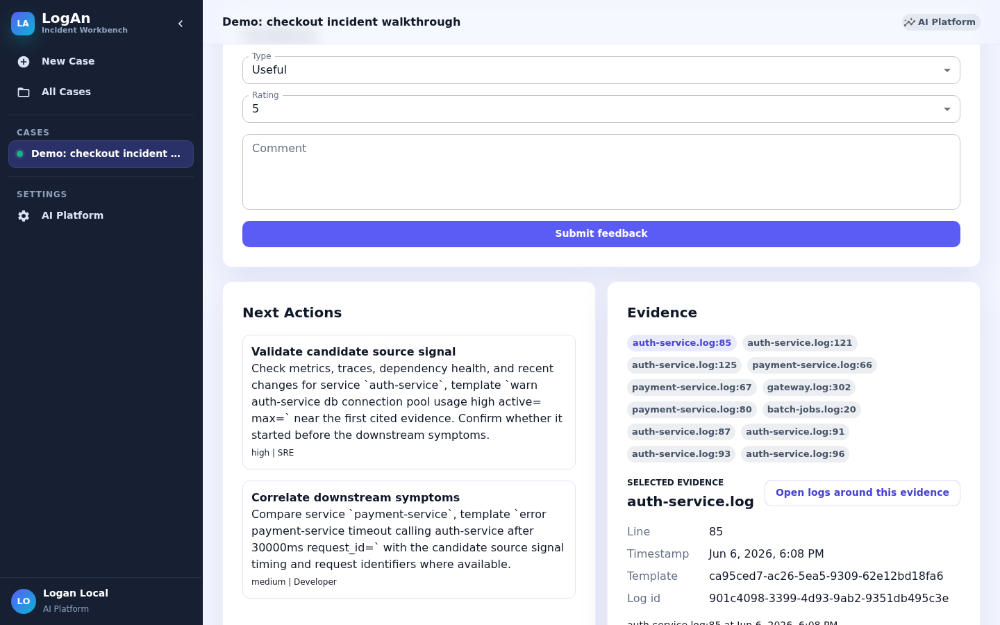

## 收尾（30 秒）

> "总结一下你们刚才看到的：几千行日志进来，出去的是——
> 8 个需要看的模板、一条时间线、一条排好序的候选因果链、一份带证据的报告。
> 而这一切跑在完全离线的确定性模式下；接上生产的 AI Platform 之后,
> 标注和总结会换成真实的大模型，界面和流程一模一样。"

---

## 常见问答（Q&A 预案）

- **"这是真的 AI 吗？"** 本地演示用确定性 mock（保证每次结果一致、可离线），生产环境走
  AI Platform 的大模型。管线、界面、脱敏保证完全相同，只是标注/总结的"大脑"不同。
- **"我们的日志安全吗？"** 模型只见每个模板的少量脱敏代表样本；指标、事件、报告里都
  刻意排除原始日志文本；所有敏感字段在管线第三步就被掩码。
- **"因果图可信吗？"** 它是**候选**因果——用时序先后、提升度、PGEM、Granger 多种
  统计证据排序，帮你决定先验证什么，不宣称证明了根因。
- **"生产怎么部署？"** SQLite/本地盘换 PostgreSQL/S3，同步分析换 Temporal 工作流，
  可选 ClickHouse/OpenSearch 做大规模报表——都是配置开关，见 README。

## Quick reference (English)

1. Start: `scripts\local.ps1` (or `make quickstart-up`). Optional pre-seed:
   `python scripts/seed_demo_case.py --logs-dir demo/logs`.
2. Sign in via mock SSO -> create case -> drag the four files from `demo/logs/` -> run analysis.
3. Walk the views: Summary (2,613 lines -> 8 templates, 99.7% reduction) -> Timeline (incident
   wave, click a peak bar) -> Logs (search `user_email` for redaction, `SocketTimeoutException`
   for the merged stack trace) -> Graph (auth pool -> payment timeout -> gateway 500; the
   batch-job disk errors stay peripheral) -> RCA (cautious narrative + exports).
4. Reset between rehearsals: stop the API, delete `.logan/`, restart, re-seed.
5. Regenerate the log set: `python scripts/generate_demo_logs.py`; regenerate these screenshots:
   `node scripts/shoot_demo_screens.js <caseId> <runId> docs/images/demo` with the app running.
